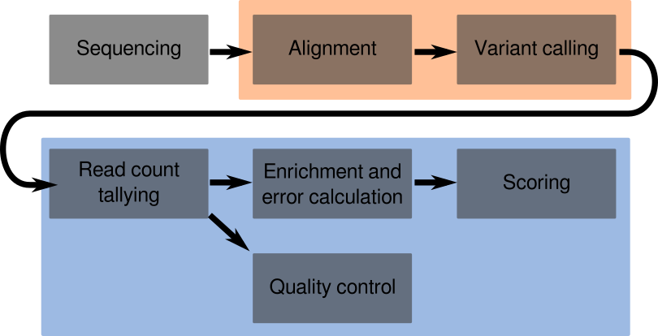

# TileSeqMave v0.6.7

TileSeqMave is a bioinformatics pipeline for processing sequencing data from MAVE experiments based on the TileSeq protocol. For more an introduction and more background on TileSeq and MAVEs see [Weile et al., 2017](http://msb.embopress.org/content/13/12/957) and [Weile & Roth., 2018](https://doi.org/10.1007/s00439-018-1916-x). The pipeline allows for the calculation of fitness scores from sequencing reads and provides a suite of quality control visualizations. 

TileSeqMave constitutes the second half of the TileSeq Pipeline. The first half is implemented in [`tileseq_mutcount`](https://github.com/RyogaLi/tilseq_mutcount) and provides alignment and variant calling of TileSeq sequencing reads.

## Table of contents

1. [Requirements and Installation](#requirements-and-installation)
2. [Overview of the pipeline](#overview-of-the-pipeline)
3. [The parameter sheet](#the-parameter-sheet)
4. [Running tileseqMave](#running-tileseqmave)  
    4.1. [Constructing the parameter sheet](#constructing-the-parameter-sheet) 
    4.2. [Converting the parameter sheet](#converting-the-parameter-sheet)  
    4.3. [Variant calling](#variant-calling)  
    4.4. [Joining variant counts and computing marginal frequencies](  #joining-variant-counts-and-computing-marginal-frequencies)  
    4.4. [Running a library QC analysis](#running-a-library-qc-analysis)  
    4.5. [Running the enrichment function](#running-the-enrichment-function)  
    4.6. [Running a Selection QC analysis](#running-a-selection-qc-analysis)
    4.7. [Scaling the final scores](#scaling-the-final-scores)

## Requirements and Installation

`tileseqMave` is compatible with Unix-based operating systems, requires R 3.4.4 or greater and has a number of R package dependencies, which will be installed automatically. It also uses the output of [`tileseq_mutcount`](https://github.com/RyogaLi/tilseq_mutcount), which should be installed separately on an HPC platform.

To install the `tileseqMave` package, use the `R` package `devtools`:

```R
install.packages("devtools")
devtools::install_github("jweile/tileseqMave")
```


**Important**: To ensure that the scripts included in this software suite can be executed easily on the command line, they need to be available via your `$PATH` variable. The easiest way to achieve this is to symlink them to your preferred `bin/` directory after having installed the package as shown above. For `UNIX` systems, a bootstrap script is provided for this purpose. For example, to create symlinks in `~/.local/bin/` you can use:

```bash
bash `Rscript -e 'cat(system.file("scripts/linkBinaries.R",package="tileseqMave"))'` ~/.local/bin/
```

### Recommended dependencies

Some of the modular components within tileseqMave also rely on other (optional) dependencies. Namely, to condense QC reports into single PDFs, `ghostscript` needs to be installed; and to conveniently draw a heatmap of the variant effect maps for the score sets calculated by tileseqMave, the [`mavevis`](https://github.com/VariantEffect/mavevis) package would need to be installed. But these functionalities are optional!

## Overview of the pipeline

As part of the greater TileSeq workflow, the TileSEQ pipeline constitutes the last link in the chain. A flowchart of the entire workflow is shown in Figure 1 below. The workflow begins with Illumina sequencing and FASTQ conversion. The FASTQ files are then fed to [`tilseq_mutcount`](https://github.com/RyogaLi/tilseq_mutcount), which performs the steps highlighted in orange: Reads are aligned to the target sequence template and then a Bayesian method is used to call the most likely true variants. This brings us to TileSeqMave, which performs the steps highlighted in blue. Using the variants called by in the previous step, TileSeqMave translates variant calls into protein-level amino acid changes, tallies them and calculates enrichment between assay conditions, while modeling the magnitude of underlying measurement error. Finally, it also provides a suite of quality control outputs. The workflow uses a standardized parameter sheet which controls the details of the execution across the entire workflow. Both `tileseq_mutcount` and TileseqMave directly use this parameter sheet extensively.



Figure 1: Overview of the TileSeq workflow.


The functions performed by TileSeqMave are organized in a set of discrete modules:

1. csv2json: This component reads and validates the parameter sheet which contains all relevant options and parameters of the experiment to be analyzed.
2. joinCounts: This module processes the individual sample-specific count files produced by `tileseq_mutcount`. The data is combined into a single table, tabulating the read counts and relative frequencies for each unique variant in each condition and replicate. It also calculates the protein-level consequences of each variant and produces marginal counts and frequencies.
3. libraryQC: Produces a number of diagnostic graphs for quality control purposes at the variant library level.
5. calcEnrichment: Calculates enrichment ratios between selective and non-selective conditions for each variant. Also performs error regularization, filtering, and bias correction.
6. selectionQC: Produces additional diagnostic graphs at the selection assay level.
7. scaleScores: This module allows users to scale the enrichment values provided by the calcEnrichment module onto a scale that represents the interval between null-like and WT-like variants. This usually requires the user to examine the output from the selectionQC to decide on suitable scaling pivot points. An automatic mode is also available in which the function will try to make a reasonable guess at suitable pivots. The output of this module is in MaveDB format and thus compatible with many other external applications from the MaveDB app ecosystem.
8. condenseQC: This is a convenience function which condenses all the individual PDF outputs generated by libraryQC and selectionQC into single printer-friendly multi-page PDF documents.
9. scaleFACS: This module is currently under active development. In the future it will provide an alternative scoring mechanic for fluorescence-activated cell sorting-based assays.

In addition to these primary modules, there are a number of secondary helper tools:

1. mavevisLocal: This tool provides easy access to [`mavevis`](https://github.com/VariantEffect/mavevis) at the command line level and can automatically visualize the output of the scaleScores module as variant effect maps.
2. colorizeStructure: This tool allows users to derive Pymol PML files from a variant effect maps, which can then be used in PyMol to colorized PDB structures.
3. dropoutTS: This is a troubleshooting and diagnosis tool to check for variant dropout due to bottlenecking across replicates or conditions.
4. popcodeOligos: This tool helps design oligo sequences for the PopCode mutagenesis method underlying most MAVE projects in the Roth Lab.
5. proveanInput: This is a helpful tool to generate an input file for PROVEAN and PolyPhen-2 based for all possible amino acid changes in a given template sequence from the parameter sheet.


## The parameter sheet

TileseqMave and `tileseq_mutcount` use a common central input document called the parameter sheet, which is designed to capture all relevant aspects of the TileSEQ experiment from which the sequencing data was generated. The parameter sheet is provided as a comma-separated-values (CSV) file, following a strict template. The easiest way to create such a file is to use a spreadsheet editor, such as Google Sheets, LibreOffice or Excel. An example spreadsheet can be found [here](https://docs.google.com/spreadsheets/d/1tIblmIFgOApPNzWN2KUwj8BKzBiJ1pOL7R4AOUGrqvE/edit?usp=sharing). From there it can be exported to CSV format and processed using the `csv2json` module which will validate the contained data and convert it into a JSON document, which is used by all downstream modules.

The parameter sheet has the following sections:

1. **Project name**: This can be any name you like.
2. **Template construct**: Here we define the sequencing template, its sequence and what it represents.
    * Gene name: The official HGNC gene name
    * Sequence: The full nucleotide sequence of the template including the coding sequence (CDS) and its flanking priming sequences.
    * CDS start: The position in the above sequence at which the coding sequence (CDS) begins. This must be an ATG codon! Numbering starts at 1, not at 0. (Don't @ me!)
    * CDS end: The equivalent sequence position at which the CDS ends. This must be in-frame with the start position, i.e. end-start+1 must be divisible by 3.
    * Uniprot Accession: The UniprotKB accession of the protein encoded by the template gene.
3. **Assay Type**: A summary of the underlying selection assay
    * Assay Name: This can be any free-text label you like. But we would encourage you to pick a simple, recognizable name such as "Y2H", "Yeast complementation" or "LDL uptake via FACS"
    * Assay Description: This can be any free-text description you like.
    * Negative selection: This field indicates whether the assay performs a positive or negative selection. So only the values "Yes" and "No" are allowed. Positive selection indicates that the assay causes damaging variants to be depleted in the pool, where as negative selection indicates that the assay causes neutral variants to be depleted. (Most assays will be positive, so for most cases the value would be "No").
4. **Conditions and replicates**: This is a custom table that lists the different experimental conditions and their intended number of replicates and time points.
    * Condition IDs: In this table row, provide a list of condition identifiers. These should be short and *must not contain any special characters or spaces*.
    * Descriptions: These can be free-text descriptions of the conditions.
    * Number of replicates: For each of the defined conditions in the previous row, provide the number of technical replicates here.
    * Number of time points: For each of the defined conditions in the first row, provide the number of time points. **Warning:** If more than one time point is used for a given condition, then all other conditions that relate to that condition (e.g. its wildtype control or its pre-selection condition) must either use the exact same timepoints or have just a single timepoint!
5. **Mutagenesis regions**: This is a fixed table defining the regions which underwent separate PopCode mutagenesis. It has the following columns:
    * Region number: A simple numbering of the regions to serve as identifiers thereof. This *must* be an integer number.
    * Start AA: The first amino acid position that counts as being within the region.
    * End AA: The last amino acid position that counts as within the region.
6. **Sequencing tiles**: This is also a fixed table, defining the eponymous TileSeq sequencing tiles in the experiment. It has the following columns:
    * Tile number: A simple numbering of the tiles to serve as identifiers thereof. These *must* be integer numbers.
    * Start AA: The first amino acid position that counts as within the tile.
    * End AA: The last amino acid position that counts as within the tile.
7. **Condition definitions**: This section is used to define the meanings of the different conditions as to how they relate to each other. Currently, two kinds of relationships are supported: `is_selection_for`, and `is_wt_control_for`. For example, if we have defined three conditions in section 4; `sel`, `non` and `ctrl`, then `sel` could be the selection condition for `non`; and `ctrl` could be the wt control for both of them. These relationships are defined using a fixed table with three columns:
    * Condition 1: The ID of the first condition in the relationship. This must have been previously declared in the list of conditions (see section 4).
    * Relationship: The name of the relationship, either `is_selection_for` or `is_wt_control_for`
    * Condition 2: The ID of the section condition in the relationship. Like the first condition, this must have been previously declared in the list of conditions.
8. **Time point definitions**: This fixed table is used to define time points in the experiment. At least one time point must be defined. The table has the following columns:
    * Time point name: The name of the time point. This should be a short identifier without spaces or special characters.
    * Time: The numerical part of time point definition.
    * Unit: The time unit, such as "s" for seconds, "m" for minutes, "h" for hours, "d" for days, etc.
9. **Sequencing samples**: This final table contains the information of what the sequencing samples represent. It has the following columns:
    * Sample ID: This is the ID of the sample used in the name of the corresponding pair of FASTQ files. This can be a number or an alphanumerical label. No special characters (except "-" signs) are allowed. However it must match the FASTQ file names.
    * Tile ID: The sequencing tile to which this sample belongs. This is a cross-reference to the "Tile Number" in the "Sequencing tiles" table and must have a matching entry there. Accordingly, the IDs *must* be integer numbers.
    * Condition: The condition to which this sample belongs. This is a cross-reference to the list of condition names and must have a matching entry there.
    * Time point: The time point to which this sample belongs. This is a cross-reference to the Time point definitions and must have a matching entry there.
    * Replicate: The replicate to which this sample belongs. This must be an integer number and must be within the range of replicates you defined in section 4 for the respective condition.
10. **Variant calling parameters**: This section contains meta-parameters for the variant caller.
    * Posterior threshold: The posterior probability of a variant call that must be surpassed for the call to be accepted (as opposed to the WT base). Must be between 0.5 and 1.
    * Minimum coverage: The fraction of a read's length that must fall within the correct tile for it to be counted. Must be between 0 and 1.
    * Per-base mutation rate: The assumed per-base mutation rate in the library as a result of PopCode mutagenesis. This is used to inform the prior probability for variant calls.
11. **Scoring function parameters**: This section contains meta-parameters for the enrichment function.
    * Minimum read count: This parameter informs the "frequency filter". It specifies the minimum marginal read count a variant must have in the non-selective condition to pass filter. Must be greater or equal to 1.
    * WT filter quantile: This parameter informs both the "frequency filter", the "bottleneck filter" and the "WT excess filter". It specifies the quantile of the WT control distribution that a variant has to exceed. If the nonselect frequency falls below this quantile, then the frequency filter applies; if the select frequency falls below this quantile then the "bottleneck:selection filter" applies. Finally, if the WT count itself exceeds this quantile, then the "WT-excess filter" applies. Valid inputs range from 0.5 to 0.999. The default setting is 0.9.
    * Replicate disagreement: This parameter informs the "bottleneck:replicate filter". It specifies the factor of how much greater the disagreement between two replicates is allowed to be compared to its expectation given their sequencing coverage. If the disagreement is greater than this factor times the expectation, then the filter applies. (For example, if the factor is `10`, then a disgreement 10x higher than expectation triggers the filter)
    * Pseudo-replicates: This parameter controls the strength of error regularization. It represents the number of pseudo-replicates assigned to the prior estimate of error during Baldi & Long error regularization. Must be at least 1.
    * SD threshold: An arbitrary standard deviation threshold below which variants should be considered "high-quality" as opposed to "low quality". This is not a hard filter, but it will determine the output of the "filter progression plot" in the selectionQC output. It is also used by the scaleScores module when "auto-pivot" is enabled, to determine the quality of variants that are included in calculating synonymous and nonsense log-ratio medians.
12. **Score scaling pivots**: While this table is necessary for the `scaleScores` module, its exact contents cannot reasonably be chosen until after inspection of the `selectionQC` results. It is therefore not necessary to include until this step is performed. Its purpose is to manually define the pivot points for the score scaling. The pivot points represent the best guess for the expected behaviour of null-like and WT-like variants. The table has the following columns:
    * Condition: The ID of the selective condition to which this pivot point applies.
    * Time point: The ID of the time point to which this pivot point applies.
    * Region: The mutagenesis region number to which this pivot point applies.
    * Type: Whether this is an override for the "synonymous" or "nonsense" mode.
    * Value: The numerical value of the log ratio mode to use.

## Running tileseqMave

### Constructing the parameter sheet
A template for the parameter sheet can be found  [here](https://docs.google.com/spreadsheets/d/1tIblmIFgOApPNzWN2KUwj8BKzBiJ1pOL7R4AOUGrqvE/edit?usp=sharing). You can use any spreadsheet software to fill it out according to the instructions above; then export it into CSV format. 

### Converting the parameter sheet
Internally, both `tileseq_mutcount` and all modules of `tileseqMave` use a JSON-formatted version of the sheet. To convert the parameter sheet from CSV to JSON format you can use the `csv2json.R` script. This will also perform a validation of the parameter sheet, ensuring that requirements have been met. The module is used as follows:

```
csv2json.R [--] [--help] [--srOverride] [--outfile OUTFILE] [--logfile LOGFILE] infile

positional arguments:
  infile            a valid parameter sheet file in CSV format

flags:
  -s, --srOverride  Manual override to allow singleton replicates. USE
                    WITH EXTREME CAUTION!

optional arguments:
  -o, --outfile     output file. Defaults to 'parameters.json' in the
                    same directory.
  -l, --logfile     log file. Defaults to 'csv2json.log' in the same
                    directory.
```

As you can see, the module allows for a flag called `--srOverride` which enables a compatibility mode with a limited feature set that allows for the processing of data sets with only a single replicate. Using this flag will show a prominent warning message about all the potential problems and side-effects of this mode. To proceed with analyzing such data sets, the flag must also be set during all subsequent analysis steps.

### Variant calling
This step is performed by [tilseq_mutcount](https://github.com/RyogaLi/tilseq_mutcount). Check out the its [github page](https://github.com/RyogaLi/tilseq_mutcount) for detailed instructions. Executing the variant caller requires a HPC environment. In the Roth Lab, we use the BC2 or DC clusters at the Donnelly Centre.

As a first step, you will need want to create a project directory in which the output will be collected. Place your parameter sheet CSV and JSON file for this project inside the folder to ensure all input and output is organized together. Ideally, you will want to name the file `parameters.json`, as this is the assumed default name and will allow you to excuted most of the downstream modules without having to specify the parameter file as an argument. Then, run the script following the instruction on the [tilseq_mutcount repository page](https://github.com/RyogaLi/tilseq_mutcount), using the project directory as the output folder.

Among the output of tileseq_mutcount, you will find a subdirectory with a name following the pattern `<tag>_<timestamp>_mut_count/`, where `<timestamp>` indicates the date and time of execution, for example: `mthfr_2020-02-20-11-15-49_mut_count/`. This `*mut_count` subdirectory will serve as the input for the next step. It contains individual count files for each sequencing sample. So you may want to move it to the top level of your project directory.

### Joining variant counts and computing marginal frequencies
In this step, we will collate the counts from the individual sequencing samples, organize them by variant and condition/replicate, and translate the called variants to protein level. This step is performed by `joinCounts.R` module. By default, it will look for the parameter sheet JSON file and the `*mut_count` directory in your current working directory and automatically proceed from there. However the command has a number of arguments that allow for more flexibility:

```
usage: joinCounts.R [--] [--help] [--srOverride]
       [--workspace WORKSPACE] [--input INPUT] [--output OUTPUT]
       [--parameters PARAMETERS] [--logfile LOGFILE] [--cores CORES]

flags:
  -h, --help        show this help message and exit
  -s, --srOverride  Manual override to allow singleton replicates. USE
                    WITH EXTREME CAUTION!

optional arguments:
  -w, --workspace   workspace data directory. Defaults to current
                    working directory
  -i, --input       input directory containing the count data. Defaults
                    to subdirectory with latest timestamp ending in
                    _mut_count
  -o, --output      output directory. Defaults to same as input
                    directory
  -p, --parameters  parameter file. Defaults to parameters.json in the
                    workspace directory.
  -l, --logfile     log file. Defaults to joinCounts.log in the
                    workspace directory
  -c, --cores       number of CPU cores to use in parallel for
                    multi-threading [default: 6]
```

Notably, `joinCounts.R` also has the ``--srOverride`` flag, which allows for limited functionality on single replicate datasets. The `-w`, `-i`, `-o`, `-p`, and `-l` options allow you to specify the locations of the input, output, parameter sheet and log files, in case you are not using the default directory structure or naming schemes for your project. 

The `-c` parameter allows you to specify the number of available CPU cores on your hardware that you are willing to use. This can help speed up the variant translation process, however it also multiplies the consumption of RAM, as each will be result in separate forked process. In other words, if using a single CPU core, the translation takes 3 hours and 500MB of RAM, then assigning 6 cores would reduce the time needed to ~30min, but would also inflate the required ram to 3GB. We therefore recommend that you choose this parameter carefully.


After completion, `joinCounts.R` will have added three new files to the `mut_count` directory: `sample_depths.csv`, `all_counts.csv` and `marginal_counts.csv`. 

 * The `sample_depths.csv` file contains a table listing the total read depth for each sequencing sample, as well as other summarizing information regarding the samples from the parameter sheet.
 * The `all_counts.csv` file will contain a huge table of all variant **combinations** found in any tile, as well as the read count and frequency of each of these combinations across all samples, organized by condition, replicate and time point. Inspecting the file using `less` will reveal that the file also contains a header that lists the project name, pipeline version and parameter sheet location.
 * The `marginal_counts.csv` file contains a table of all unique amino acid changes, as well as their marginal counts and marginal frequencies. The term "marginal" indicates that these counts and frequencies explicitly *ignore any co-occurrences* between variants, and thus do not behave in an an additive fashion. In other words, they together make up more than 100% of the actual reads. Like the previous file, `marginal_counts.csv` also starts with a header with key information about the project.
 
 
### Running a library QC analysis
After `joinCounts.R` has completed, a library QC analysis can be performed using `runLibraryQC.R`. This will generate a number of diagnostic plots for each **non-select condition** in the data set. Like the previous module, by default, `runLibraryQC.R` will look for the parameter sheet JSON file and the `*mut_count` directory in your current working directory and automatically proceed from there, but a number of arguments allow for more flexibility:

```
usage: runLibraryQC.R [--] [--help] [--srOverride] [--allConditions]
       [--workspace WORKSPACE] [--input INPUT] [--output
       OUTPUT] [--parameters PARAMETERS] [--logfile LOGFILE] [--cores
       CORES] [--wmThreshold WMTHRESHOLD]

flags:
  -h, --help           show this help message and exit
  -s, --srOverride     Manual override to allow singleton replicates.
                       USE WITH EXTREME CAUTION!
  -a, --allConditions  Run on all conditions instead of just nonselect.

optional arguments:
  -w, --workspace      workspace data directory. Defaults to current
                       working directory
  -i, --input          input directory containing the count data.
                       Defaults to subdirectory with latest timestamp
                       ending in _mut_count
  -o, --output         output directory. Defaults to name of input
                       directory with _QC tag
  -p, --parameters     parameter file. Defaults to parameters.json in
                       the data directory.
  -l, --logfile        log file. Defaults to libraryQC.log in the same
                       directory
  -c, --cores          number of CPU cores to use in parallel for
                       multi-threading [default: 6]
  --wmThreshold        Define the marginal frequency threshold for
                       well-measuredness. [default: 5e-5]
```

The `--srOverride`, `-w`, `-i`, `-o`, `-p`, `-l`, and `-c` options operate as before (see [above](#joining-variant-counts-and-computing-marginal-frequencies)). But you may notice a few additional arguments. As mentioned above, this QC function is intended to be run on **nonselect** conditions only. To override this default behaviour: `-a` allows for the library QC to be performed on **all** conditions instead. However, it should be noted that this prevents normalization against the WT control, as most other conditions do not have a defined relationship with the control in the parameter sheet. Finally, the `--wmThreshold` allows for modifying the marginal frequency threshold at which variants are to be considered "well-measured", which will indicated by markers on a number of output plots.

This module produces a number of diagnostic plots in PDF format. All the plots will be saved as PDF files in a new folder called `<timestamp>_QC` (where `timestamp` is the time of the original variant caller execution). A helper tool---`condenseQC.R`---can be used to combine all the individual plots into a single printer-friendly PDF document.

  * The Coverage map shows a heatmap of marginal frequencies for all possible amino acid changes across all tiles. Above the heatmap, bar-plots show the distribution of the number of variants observed in each read for each tile. They also indicate the total number of reads for that tile, as well as the $\lambda$ parameter. The $\lambda$ parameter represents the mean of the best fitting Poisson model for the distribution of the number variants observed in each read.
  * The "regional extrapolation"" plot builds upon the previous point: It extrapolates the poisson distribution for the number of mutations in each mutagenesis region, based on the observations in the underlying tiles.
  * The "Well-measuredness" or "Virtual Downsampling" plot shows the progression of how many variants are observed at increasing marginal frequency thresholds. Thus it expresses how many variants would still be observed if sequencing depth had been lower. This is broken down into different categories: The fraction of all possible codon changes, the fraction of all possible single nucleotide changes (SNVs), the fraction of all possible amino-acid changes, and the fraction of all possible SNV-reachable amino-acid changes.
  * The "replicate agreement" plot shows scatterplots between the technical replicates of the nonselect condition. This allows for the diagnosis of potential replicate bottlenecking or biases.
  * The "WT frequency" plot compares the distribution of marginal frequencies in the nonselect condition against the WT condition and helps diagnose systematic biases in the Tiling PCR or sequencing error.
  * The "Jackpot plot" shows the marginal frequencies of all variants in decreasing order, highlighting variants with unusually high frequencies that may indicate problems with the PCR template or jackpots due to premature selection effects. It also highlights the fraction of variants whose marginal frequency is dangerously low and are thus underrepresented.
  * The "Complexity diagnostic" plots the marginal frequency of variants against the number of unique genetic contexts in which they were observed, i.e. the number of combinations in which it co-occurred with other variants. Ideally, these should be in correlation with each other. A departure from correlation indicates that some combinations of variants are over- or under-represented.
  * Variant-type breakdown: This plot shows the sums of marginal frequencies for different types of mutations in each tile. Similar to the $\lambda$ parameter, these sums can be interpreted as a rough estimate of the average number of mutations of a given type per read in each tile under the assumption of perfect linkage equilibrium.
  * Nucleotide bias analysis: This collection of plots (one for each tile) is divided in to two halves. The left halves shows the frequency of each possible nucleotide change in codons containing single nucleotide changes; while the right half does the same for multi-nucleotide variants (MNVs), such as the ones introduced by PopCode oligos. By default, one would expect single nucleotide changes to primarily occur due to Polymerase error, and to be biased toward transitions rather than transversions. Conversely, MNVs should be expected to be unbiased, except in the last position of the codon, where the NNK degeneracy of PopCode oligos only allows for Guanine and Thymine changes.
  * The "frameshift hotspot" plot shows the distribution of frameshift variants across the template sequence and notes their marginal frequencies. This allows for the diagnosis of high-frequency frameshifts in sequence hotspots.
  
For simple library QC runs that are only interesting in assessing the quality of a PopCode library, the analysis ends here. However if the experiment you are analyzing is a full MAVE assay, you will want to proceed with the enrichment function next.

### Running the enrichment function
After `joinCounts.R` has completed (and optionally `runLibraryQC.R`), the enrichment function `calcEnrichment.R` can be called. This module will analyze the enrichment of variants as a result of selection in the underlying assay.
Thus, it requires that at least one selection condition was declared in the parameter sheet. The enrichment function will then:

 * Create error models for each tile and condition and use these models for error regularization
 * Perform quality filtering (based on non-select counts, disagreement between replicates, signatures of bottlenecking or of excess sequencing error in the WT control)
 * Calculate log ratios (called $log(\varphi)$) and perform bias correction with respect to the magnitude of underlying sequencing reads. 
 * Use bootstrapping to determine the confidence levels in terms of standard error around the reported bias-corrected enrichment (BCE) values.
 
Like the previous modules, `calcEnrichment.R` will by default look for the parameter sheet JSON file and the `*mut_count` directory in your current working directory and automatically proceed from there, but a number of arguments allow for more flexibility:

```
usage: calcEnrichment.R [--] [--help] [--srOverride] [--bnOverride]
       [--optimistic] [--workspace WORKSPACE] [--input INPUT] 
       [--output OUTPUT] [--parameters PARAMETERS] [--logfile LOGFILE] 
       [--cores CORES] [--bootstrap BOOTSTRAP]

flags:
  -h, --help        show this help message and exit
  -s, --srOverride  Manual override to allow singleton replicates. USE
                    WITH EXTREME CAUTION!
  -b, --bnOverride  Manual override to disable bottleneck filtering. USE
                    WITH EXTREME CAUTION!
  --optimistic      Uses bayesian regularization instead of maximizing
                    between prior and empiric SD

optional arguments:
  -w, --workspace   workspace data directory. Defaults to current
                    working directory
  -i, --input       input directory containing the count data. Defaults
                    to subdirectory with latest timestamp ending in
                    _mut_count
  -o, --output      output directory. Defaults to name of input
                    directory with _scores tag
  -p, --parameters  parameter file. Defaults to parameters.json in the
                    data directory.
  -l, --logfile     log file. Defaults to 'enrichment.log' in the same
                    directory
  -c, --cores       number of CPU cores to use in parallel for
                    multi-threading [default: 6]
  --bootstrap       Number of bootstrap samples to use. NA uses
                    heuristics instead. [default: 10000]
```

The `--srOverride`, `-w`, `-i`, `-o`, `-p`, `-l`, and `-c` options operate as before (see [above](#joining-variant-counts-and-computing-marginal-frequencies)). But you may notice a few additional arguments.
The `--bnOverride` flag allows the disabling of bottleneck filters. This is not recommended and generally intended only for testing purposes. Instead, you may wish to adjust the filter parameters in the parameter sheet.
The `--optimistic` argument adjusts the error regularization method to use a more optimistic model. Rather than using the maximum error predicted by either the model or the empirical replicate disagreement, it uses forms Bayesian weighted average (based on the pseudo-replicates assigned in the parameter sheet).
The `--bootstrap` argument This can be used to set the number of samples to use for bootstrapping. Greater values increase runtime, but may result in higher precision of error estimates (subject to diminishing returns). To disable bootstrapping, this can be set to NA or 0, in which case analytical error propagation is used instead.

The results of the enrichment function will be produced in a new directory called `<timestamp>_scores` (where `timestamp` is again the time of the original variant caller execution). It will contain a CSV-formatted file for each selection condition called `complete.csv`; a table containing all intermediate results for all variants of the internal calculations, regardless of filter status. A column called "filter" indicates whether the variant was filtered out and if so, for what reason. The table will be preceded by a header which recapitulates key parameter settings from the parameter sheet as well as the project name, date and software version.

At the end of the enrichment step, either a selection QC step can be performed to gain insight into the quality of the assay, or alternatively, one may proceed directly to the final score scaling step.


### Running a Selection QC analysis
After the enrichment module has been executed, a selection QC can be performed using `runSelectionQC.R`. Similarly to the library QC function, this will generate a number of diagnostic plots as PDF files. Like the previous modules, it will by default look for the parameter sheet JSON file, the `*_mut_count`, and the `*_scores` directory in your current working directory and automatically proceed from there, but a number of arguments allow for more flexibility:

```
usage: runSelectionQC.R [--] [--help] [--srOverride] 
       [--workspace WORKSPACE] [--counts COUNTS] [--scores SCORES]
       [--output OUTPUT] [--parameters PARAMETERS] [--logfile LOGFILE]

flags:
  -h, --help        show this help message and exit
  --srOverride      Manual override to allow singleton replicates. USE
                    WITH EXTREME CAUTION!

optional arguments:
  -w, --workspace   workspace data directory. Defaults to current
                    working directory
  -c, --counts      input directory containing the count data. Defaults
                    to subdirectory with latest timestamp ending in
                    _mut_count
  -s, --scores      input directory containing the score data. Defaults
                    to subdirectory with latest timestamp ending in
                    _scores
  -o, --output      output directory. Defaults to name of input
                    directory with _scores tag
  -p, --parameters  parameter file. Defaults to parameters.json in the
                    data directory.
  -l, --logfile     log file. Defaults to selectionQC.log in the same
                    directory
```

The `--srOverride`, `-w`, `-o`, `-p`, and `-l`, options operate as before (see [above](#joining-variant-counts-and-computing-marginal-frequencies)). However, you will notice that instead of the generic input argument of previous modules, this module distinguishes between two different inputs: `-c` for the `mut_counts` folder and `-s` for the `_scores` folder. 

The `runSelectionQC.R` module will write its output as PDF files into the same `_QC` that was previously used by the library QC module. Using the helper tool `condenseQC.R` the individual files can be condensed into a single printer-friendly PDF document. The output will contain the following diagnostic plots:

  * Replicate correlation: These plots are related to the replicate correlation plots found in the library QC output, but the differ from them in a number of important ways. Firstly, they are subject to the filters enacted by the enrichment step and can thus serve as a means to gauge the effect of filtering on the correlation when comparing them to their counterparts from the library QC step. Secondly, you will find not only the replicate correlation at the level of nonselect reads, but also another plot that compares replicates at a hypothetical $log(\varphi)$ enrichment level. This simulates what the agreement between $log(\varphi)$ scores would be if replicates had been treated separately from one another. It is important to remember that this is a **hypothetical** scenario, as the actual process underlying the enrichment procedure combines replicates early on to work with their means and standard deviations instead.
  * $log(\varphi)$ bias plots: These plots show for each region of the gene the direction of any detected bias within synonymous and nonsense variants with respect to their underlying read frequencies. This helps inform the way in which bias correction was enacted by the enrichment method to produce the final BCE values.
  * Codon correlation: This page shows three related plots. The bar-plot on top indicates the number of amino acid changes that are represented by 1,2,3,... etc equivalent codon changes in the library. The scatterplot below shows the correlation between the enrichment values observed for pairs of such equivalent codon changes. Finally, the plot on the bottom compares the difference in enrichment between codon change pairs to their maximum standard deviation and can thus help determine if differences are primarily due to measurement error or biology-driven.
  * Filter progression: This plot shows for each mutagenesis region the progression of how many variants survived through different stages of the workflow. This is broken down into four categories: Codon changes, single-nucleotide changes, amino acid changes, and single-nucleotide-reachable amino acid changes. The top row shows all theoretically possible variants given the template sequence. The second row shows the number of variants that were observed with at least one sequencing read. The third row shows the number of variants that passed all filters in the enrichment module, namely the frequency filter, condition and replicate bottleneck filters and WT-excess filter. Finally, the last row shows the number of variants that could be considered of "high" quality given the standard error threshold defined in the parameter sheet.
  * Synonymous-nonsense tracks: This plot shows moving averages of nonsense and synonymous variant enrichment values across the template sequence. This helps indicate regions of the gene in which the selection assay may have performed in an unexpected way.
  * BCE distributions: These plots show the overall distribution of missense (gray), as well as nonsense and synonymous (red and green) enrichment values in each region. Their respective medians and the 10th percentile of the missense distribution are also indicated. This plot is intended to be used as a source of information towards deciding on scaling pivots for the final scoring step in the next module.
  * Error regularization QC: These plots illustrate for each tile how well the error corresponds to the expected Poisson model. It plots raw nonselect read counts against the observed coefficient of variation between replicates (i.e. the standard deviation divided by the mean). The green dotted line indicates the default behaviour under a Poisson distribution. The red line indicates a moving median, while the blue line finally indicates the best fitting model that was used for error regularization.
  * Error Profiles: These plots compare the $log(\varphi)$ or BCE enrichment of each variant against their associated standard deviation. It can be expected that deleterious variants have higher amounts of error due to them being at a sampling disadvantage in the selection condition. A blue line indicates a the running median and a red line indicates a model fit, which the enrichment and scoring modules use to calculate the "residual error" of a variant which can be used to counteract the confidence bias where weighted averages are used.


### Scaling the final scores
After the enrichment process has been completed, it is recommended that you run the selectionQC as shown above and inspect the BCE distributions. These will yield insights into where to place place the pivot points for the scaling process. The aim is to find BCE values for each tile (and each selection condition if there is more than one) that represent the expected behavior of a null-like and WT-like variant. Often, this is well-approximated by the median of the synonymous and null distributions, respectively, but other considerations can influence this decision. Once a decision has been made, you can enter the pivot points into the parameter sheet (in the scaling pivots section) and re-validate it using the `csv2json.R` module. Then, the `scaleScores.R` module can be used to enact the scaling based on these pivots.
Like the previous modules, `scaleScores.R` will by default look for the parameter sheet JSON file, the `*_mut_count`, and the `*_scores` directory in your current working directory and automatically proceed from there, but a number of arguments allow for more flexibility:
```
usage: scaleScores.R [--] [--help] [--srOverride] [--bnOverride]
       [--autoPivot] [--workspace WORKSPACE] [--scores SCORES] 
       [--output OUTPUT] [--parameters PARAMETERS] [--logfile
       LOGFILE]

flags:
  -h, --help        show this help message and exit
  --srOverride      Manual override to allow singleton replicates. USE
                    WITH EXTREME CAUTION!
  -b, --bnOverride  Manual override to disable bottleneck filtering.
  -a, --autoPivot   Automatically determine scale pivots with requiring
                    definitions in parameter sheet

optional arguments:
  -w, --workspace   workspace data directory. Defaults to current
                    working directory
  -s, --scores      input directory containing the score data. Defaults
                    to subdirectory with latest timestamp ending in
                    _scores
  -o, --output      output directory. Defaults to name of input
                    directory with _scores tag
  -p, --parameters  parameter file. Defaults to parameters.json in the
                    data directory.
  -l, --logfile     log file. Defaults to selectionQC.log in the same
                    directory
```
The `--srOverride`, `--bnOverride`, `-w`, `-s`, `-o`, `-p`, and `-l`, options all operate the same as in the `calcEnrichment.R` module (see [above](#running-the-enrichment-function)). In addition, the `--autoPivot` flag is avaible. It allows to bypass the requirement for setting pivot points in the parameter sheet and automatically uses the medians of the synonymous and nonsense distributions. Use with caution!

The output of `scaleScores.R` will be written to the `_scores` subfolder (like the output of `calcEnrichment.R` before). For each selection condition, it will generate:

 * `simple.csv`: A simplified result file with the scaled scores in MaveDB-compatible format, containing only the variants that passed all filters with their final scores and their associated error.
 * `simple_aa.csv`: The scaled scores at amino acid change level scores via confidence-weighted averaging of  equivalent codon changes. This file is also in MaveDB format.
 * `simple_aa_floored.csv`: Same as above but with scores floored to 0 before averaging.
 
All the above files are preceded by headers that list crucial parameters, a link to the parameter sheet, as well as the project name and the software version.


